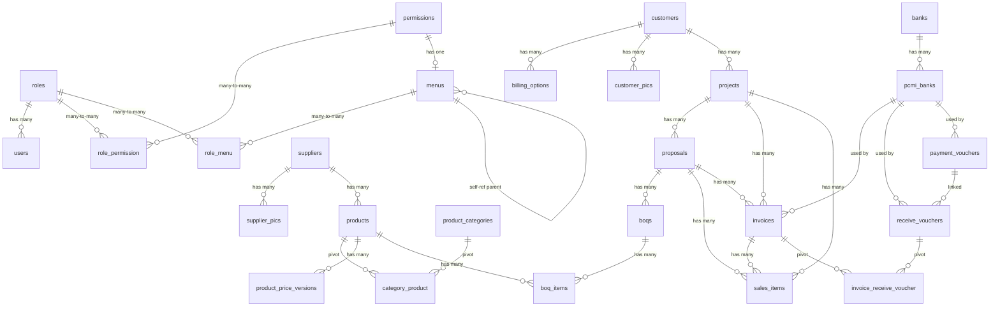

# CMS Full Architecture Documentation

> **Hasil analisis lengkap** dari seluruh source code CMS yang existing.  
> Stack: **Laravel (PHP)** + **MariaDB/MySQL** + **Vanilla JS/jQuery/DataTables** + **Blade Templates**

---

## Table of Contents

1. [Database Schema](#1-database-schema)
2. [Entity Relationship Diagram](#2-entity-relationship-diagram)
3. [Backend Architecture (Laravel)](#3-backend-architecture-laravel)
4. [Frontend Architecture (JavaScript)](#4-frontend-architecture-javascript)
5. [Business Logic & Flow per Module](#5-business-logic--flow-per-module)
6. [Recreation Plan: PostgreSQL + NestJS + React](#6-recreation-plan-postgresql--nestjs--react)

---

## 1. Database Schema

### 1.1 `roles`
| Column | Type | Constraints |
|--------|------|-------------|
| id | BIGINT | PK, AUTO_INCREMENT |
| name | VARCHAR(100) | UNIQUE |
| slug | VARCHAR(150) | UNIQUE |
| description | VARCHAR(255) | NULLABLE |
| created_at | TIMESTAMP | |
| updated_at | TIMESTAMP | |

### 1.2 `permissions`
| Column | Type | Constraints |
|--------|------|-------------|
| id | BIGINT | PK, AUTO_INCREMENT |
| route | VARCHAR(150) | UNIQUE — e.g. `project.create` |
| method | VARCHAR(10) | NULLABLE — GET, POST, etc. |
| path | VARCHAR(255) | NULLABLE — e.g. `/projects/{id}` |
| description | VARCHAR(255) | NULLABLE |
| created_at | TIMESTAMP | |
| updated_at | TIMESTAMP | |

### 1.3 `role_permission` (Pivot)
| Column | Type | Constraints |
|--------|------|-------------|
| role_id | BIGINT | FK → roles(id) CASCADE DELETE |
| permission_id | BIGINT | FK → permissions(id) CASCADE DELETE |
| created_at | TIMESTAMP | |
| updated_at | TIMESTAMP | |

**PK:** Composite (`role_id`, `permission_id`)  
**Index:** (`role_id`, `permission_id`)

### 1.4 `users`
| Column | Type | Constraints |
|--------|------|-------------|
| id | BIGINT | PK, AUTO_INCREMENT |
| name | VARCHAR(255) | NOT NULL |
| email | VARCHAR(255) | UNIQUE |
| email_verified_at | TIMESTAMP | NULLABLE |
| password | VARCHAR(255) | NOT NULL, hashed |
| phone | VARCHAR(255) | NULLABLE |
| location | VARCHAR(255) | NULLABLE |
| status | ENUM('Active','Inactive','Suspended') | DEFAULT 'Active' |
| role_id | BIGINT | NULLABLE, FK → roles(id) SET NULL ON DELETE, CASCADE ON UPDATE |
| remember_token | VARCHAR(100) | |
| created_at | TIMESTAMP | |
| updated_at | TIMESTAMP | |

**Auth:** JWT (tymon/jwt-auth) + Laravel Session

### 1.5 `password_reset_tokens`
| Column | Type | Constraints |
|--------|------|-------------|
| email | VARCHAR(255) | PK |
| token | VARCHAR(255) | |
| created_at | TIMESTAMP | NULLABLE |

### 1.6 `sessions`
| Column | Type | Constraints |
|--------|------|-------------|
| id | VARCHAR(255) | PK |
| user_id | BIGINT | NULLABLE, INDEXED, FK → users |
| ip_address | VARCHAR(45) | NULLABLE |
| user_agent | TEXT | NULLABLE |
| payload | LONGTEXT | |
| last_activity | INT | INDEXED |

### 1.7 `menus`
| Column | Type | Constraints |
|--------|------|-------------|
| id | BIGINT | PK, AUTO_INCREMENT |
| parent_id | BIGINT | NULLABLE, FK → menus(id) NULL ON DELETE, self-referential |
| name | VARCHAR(100) | NOT NULL |
| icon | VARCHAR(100) | NULLABLE |
| permission_id | BIGINT | NULLABLE, FK → permissions(id) NULL ON DELETE |
| order_index | INT | DEFAULT 0 |
| is_visible | BOOLEAN | DEFAULT true |
| created_at | TIMESTAMP | |
| updated_at | TIMESTAMP | |

**Index:** `parent_id`

### 1.8 `role_menu` (Pivot)
| Column | Type | Constraints |
|--------|------|-------------|
| id | BIGINT | PK, AUTO_INCREMENT |
| role_id | BIGINT | FK → roles(id) CASCADE DELETE |
| menu_id | BIGINT | FK → menus(id) CASCADE DELETE |
| created_at | TIMESTAMP | |
| updated_at | TIMESTAMP | |

**Unique:** (`role_id`, `menu_id`)

### 1.9 `customers`
| Column | Type | Constraints |
|--------|------|-------------|
| id | BIGINT | PK, AUTO_INCREMENT |
| code | VARCHAR(255) | UNIQUE, INDEXED — auto: `CST-{YYYYMMDD}-{RAND5}` |
| name | VARCHAR(255) | NOT NULL, INDEXED |
| bank_name | VARCHAR(255) | NULLABLE |
| bank_account_number | VARCHAR(255) | NULLABLE |
| bank_account_name | VARCHAR(255) | NULLABLE |
| status | ENUM('Active','Inactive') | DEFAULT 'Active', INDEXED |
| notes | TEXT | NULLABLE |
| created_at | TIMESTAMP | |
| updated_at | TIMESTAMP | |
| deleted_at | TIMESTAMP | NULLABLE (Soft Delete) |

### 1.10 `billing_options`
| Column | Type | Constraints |
|--------|------|-------------|
| id | BIGINT | PK, AUTO_INCREMENT |
| customer_id | BIGINT | FK → customers(id) CASCADE DELETE |
| cp_name | VARCHAR(255) | NULLABLE — Contact Person name |
| cp_title_division | VARCHAR(255) | NULLABLE |
| cp_email | VARCHAR(255) | NULLABLE |
| cp_office_number | VARCHAR(255) | NULLABLE |
| cp_mobile_number | VARCHAR(255) | NULLABLE |
| is_overseas | BOOLEAN | DEFAULT false |
| address | TEXT | NULLABLE |
| created_at | TIMESTAMP | |
| updated_at | TIMESTAMP | |
| deleted_at | TIMESTAMP | NULLABLE (Soft Delete) |

### 1.11 `customer_pics`
| Column | Type | Constraints |
|--------|------|-------------|
| id | BIGINT | PK, AUTO_INCREMENT |
| customer_id | BIGINT | FK → customers(id) CASCADE DELETE, INDEXED |
| name | VARCHAR(255) | NOT NULL, INDEXED |
| email | VARCHAR(255) | NULLABLE |
| phone | VARCHAR(255) | NULLABLE |
| position | VARCHAR(255) | NULLABLE |
| status | ENUM('active','inactive') | DEFAULT 'active', INDEXED |
| notes | TEXT | NULLABLE |
| created_at | TIMESTAMP | |
| updated_at | TIMESTAMP | |
| deleted_at | TIMESTAMP | NULLABLE |

### 1.12 `suppliers`
| Column | Type | Constraints |
|--------|------|-------------|
| id | BIGINT | PK, AUTO_INCREMENT |
| code | VARCHAR(255) | UNIQUE, INDEXED — auto: `SUP-{YYYYMMDD}-{RAND5}` |
| name | VARCHAR(255) | NOT NULL, INDEXED |
| address | TEXT | NOT NULL |
| contact_person | VARCHAR(255) | NULLABLE |
| phone | VARCHAR(255) | NOT NULL |
| email | VARCHAR(255) | NULLABLE |
| tax_number | VARCHAR(255) | NULLABLE, INDEXED (NPWP) |
| bank_name | VARCHAR(255) | NULLABLE |
| bank_account_number | VARCHAR(255) | NULLABLE |
| bank_account_name | VARCHAR(255) | NULLABLE |
| status | ENUM('Active','Inactive') | DEFAULT 'Active', INDEXED |
| notes | TEXT | NULLABLE |
| created_at | TIMESTAMP | |
| updated_at | TIMESTAMP | |
| deleted_at | TIMESTAMP | NULLABLE |

### 1.13 `supplier_pics`
| Column | Type | Constraints |
|--------|------|-------------|
| id | BIGINT | PK, AUTO_INCREMENT |
| supplier_id | BIGINT | FK → suppliers(id) CASCADE DELETE, INDEXED |
| name | VARCHAR(255) | NOT NULL, INDEXED |
| email | VARCHAR(255) | NULLABLE |
| phone | VARCHAR(255) | NULLABLE |
| position | VARCHAR(255) | NULLABLE |
| status | ENUM('active','inactive') | DEFAULT 'active', INDEXED |
| notes | TEXT | NULLABLE |
| created_at | TIMESTAMP | |
| updated_at | TIMESTAMP | |
| deleted_at | TIMESTAMP | NULLABLE |

### 1.14 `product_categories`
| Column | Type | Constraints |
|--------|------|-------------|
| id | BIGINT | PK, AUTO_INCREMENT |
| name | VARCHAR(255) | UNIQUE |
| description | VARCHAR(255) | NULLABLE |
| created_at | TIMESTAMP | |
| updated_at | TIMESTAMP | |

### 1.15 `products`
| Column | Type | Constraints |
|--------|------|-------------|
| id | BIGINT | PK, AUTO_INCREMENT |
| code | VARCHAR(255) | UNIQUE — auto: `PRD-{YYYYMMDD}-{RAND5}` |
| name | VARCHAR(255) | NOT NULL |
| description | TEXT | NULLABLE |
| unit | VARCHAR(50) | NOT NULL |
| supplier_id | BIGINT | NULLABLE, FK → suppliers(id) SET NULL ON DELETE, CASCADE ON UPDATE |
| created_at | TIMESTAMP | |
| updated_at | TIMESTAMP | |

### 1.16 `category_product` (Pivot M:N)
| Column | Type | Constraints |
|--------|------|-------------|
| id | BIGINT | PK, AUTO_INCREMENT |
| product_id | BIGINT | FK → products(id) CASCADE |
| category_id | BIGINT | FK → product_categories(id) CASCADE |
| created_at | TIMESTAMP | |
| updated_at | TIMESTAMP | |

**Unique:** (`product_id`, `category_id`)

### 1.17 `product_price_versions`
| Column | Type | Constraints |
|--------|------|-------------|
| id | BIGINT | PK, AUTO_INCREMENT |
| product_id | BIGINT | FK → products(id) CASCADE DELETE |
| version | INT | DEFAULT 1 |
| price | DECIMAL(15,2) | DEFAULT 0 |
| is_active | BOOLEAN | DEFAULT true |
| effective_from | TIMESTAMP | DEFAULT CURRENT |
| effective_until | TIMESTAMP | NULLABLE |
| created_at | TIMESTAMP | |
| updated_at | TIMESTAMP | |

**Unique:** (`product_id`, `version`)  
**Index:** (`product_id`, `is_active`)

### 1.18 `projects`
| Column | Type | Constraints |
|--------|------|-------------|
| id | BIGINT | PK, AUTO_INCREMENT |
| code | VARCHAR(255) | UNIQUE — auto: `PRJ-{YYYYMMDD}-{RAND5}` |
| name | VARCHAR(255) | NOT NULL |
| ref_doc_no | VARCHAR(255) | NOT NULL |
| value | DECIMAL(15,2) | NOT NULL |
| start_date | DATE | NOT NULL |
| end_date | DATE | NOT NULL |
| due_date | DATE | NOT NULL |
| description | TEXT | NULLABLE |
| customer_id | BIGINT | NULLABLE, FK → customers(id) CASCADE DELETE |
| status | ENUM('Active','Inactive','Completed','Cancelled') | DEFAULT 'Active' |
| type | ENUM('FIT','Regular') | DEFAULT 'Regular' |
| sales_code | VARCHAR(255) | UNIQUE, NULLABLE |
| created_at | TIMESTAMP | |
| updated_at | TIMESTAMP | |
| deleted_at | TIMESTAMP | NULLABLE |

### 1.19 `banks`
| Column | Type | Constraints |
|--------|------|-------------|
| id | BIGINT | PK, AUTO_INCREMENT |
| bank_code | CHAR(3) | UNIQUE — e.g. "014" for BCA |
| bank_name | VARCHAR(255) | INDEXED |
| bank_brand | VARCHAR(50) | NULLABLE |
| bank_address | TEXT | NULLABLE |
| created_at | TIMESTAMP | |
| updated_at | TIMESTAMP | |

### 1.20 `pcmi_banks` (Company Bank Accounts)
| Column | Type | Constraints |
|--------|------|-------------|
| id | BIGINT | PK, AUTO_INCREMENT |
| bank_id | BIGINT | FK → banks(id) CASCADE UPDATE, RESTRICT DELETE |
| type | ENUM('Bank','Credit Card') | DEFAULT 'Bank' |
| user_id | BIGINT | NULLABLE, FK → users(id) NULL ON DELETE |
| account_no | VARCHAR(50) | NOT NULL |
| branch | VARCHAR(255) | NULLABLE |
| swift_code | VARCHAR(20) | NULLABLE |
| holder_name | VARCHAR(255) | NOT NULL |
| created_at | TIMESTAMP | |
| updated_at | TIMESTAMP | |

### 1.21 `proposals`
| Column | Type | Constraints |
|--------|------|-------------|
| id | BIGINT | PK, AUTO_INCREMENT |
| project_id | BIGINT | FK → projects(id) CASCADE DELETE |
| code | VARCHAR(255) | UNIQUE — auto: `PRP-{YYYYMMDD}-{RAND5}` |
| sales_code | VARCHAR(255) | UNIQUE, NULLABLE — generated on Win: `REG-{last5}-{date}-{seq}` |
| note | TEXT | NULLABLE |
| status | ENUM('Draft','Submitted','Win','Lose','Cancelled') | DEFAULT 'Draft' |
| total_amount_items | DECIMAL(15,2) | NULLABLE |
| pricing_model | ENUM('A','B','C','D') | NULLABLE |
| management_fee_type | ENUM('nominal','percent') | DEFAULT 'percent' |
| management_fee | DECIMAL(15,2) | DEFAULT 0 |
| vat_rate | INT | DEFAULT 11 |
| pricing_model_description | TEXT | NULLABLE |
| created_at | TIMESTAMP | |
| updated_at | TIMESTAMP | |
| deleted_at | TIMESTAMP | NULLABLE |

### 1.22 `boqs` (Bill of Quantities)
| Column | Type | Constraints |
|--------|------|-------------|
| id | BIGINT | PK, AUTO_INCREMENT |
| code | VARCHAR(255) | UNIQUE — auto: `BOQ-{YYYYMMDD}-{RAND5}` |
| proposal_id | BIGINT | NULLABLE, FK → proposals(id) CASCADE DELETE |
| total_amount_items | DECIMAL(15,2) | NULLABLE |
| created_at | TIMESTAMP | |
| updated_at | TIMESTAMP | |

### 1.23 `boq_items`
| Column | Type | Constraints |
|--------|------|-------------|
| id | BIGINT | PK, AUTO_INCREMENT |
| boq_id | BIGINT | FK → boqs(id) CASCADE DELETE |
| product_id | BIGINT | FK → products(id) CASCADE DELETE |
| product_price_version_id | BIGINT | NULLABLE, FK → product_price_versions(id) NULL ON DELETE |
| description | TEXT | NULLABLE |
| selling_price | DECIMAL(15,2) | NOT NULL |
| qty | INT | DEFAULT 1 |
| qty_unit | VARCHAR(255) | NULLABLE |
| freq | INT | DEFAULT 1 |
| freq_unit | VARCHAR(255) | NULLABLE |
| total_price | DECIMAL(15,2) | NOT NULL — `qty * freq * selling_price` |
| created_at | TIMESTAMP | |
| updated_at | TIMESTAMP | |

### 1.24 `sales_items` (Proposal/Invoice Line Items)
| Column | Type | Constraints |
|--------|------|-------------|
| id | BIGINT | PK, AUTO_INCREMENT |
| project_id | BIGINT | NULLABLE, FK → projects(id) CASCADE DELETE |
| proposal_id | BIGINT | NULLABLE, FK → proposals(id) CASCADE DELETE |
| invoice_id | BIGINT | NULLABLE, FK → invoices(id) NULL ON DELETE |
| product_id | BIGINT | NULLABLE, FK → products(id) CASCADE DELETE |
| product_price_version_id | BIGINT | NULLABLE, FK → product_price_versions(id) NULL ON DELETE |
| description | TEXT | NULLABLE |
| selling_price | DECIMAL(15,2) | NOT NULL |
| title1_key | VARCHAR(255) | NULLABLE |
| title1_value | INT | NULLABLE |
| title2_key | VARCHAR(255) | NULLABLE |
| title2_value | INT | NULLABLE |
| title3_key | VARCHAR(255) | NULLABLE |
| title3_value | INT | NULLABLE |
| title4_key | VARCHAR(255) | NULLABLE |
| title4_value | INT | NULLABLE |
| total_price | DECIMAL(15,2) | NOT NULL |
| header | VARCHAR(255) | NULLABLE — grouping for Type B/C/D |
| subheader | VARCHAR(255) | NULLABLE |
| header_order | INT | DEFAULT 0 |
| created_at | TIMESTAMP | |
| updated_at | TIMESTAMP | |

### 1.25 `invoices`
| Column | Type | Constraints |
|--------|------|-------------|
| id | BIGINT | PK, AUTO_INCREMENT |
| code | VARCHAR(255) | UNIQUE — auto-generated |
| invoice_number | VARCHAR(255) | NOT NULL — format: `P-XXX/...` |
| due_date | DATE | NOT NULL |
| sales_code | VARCHAR(255) | NULLABLE, INDEXED — snapshot |
| project_id | BIGINT | NULLABLE, FK → projects(id) CASCADE DELETE |
| proposal_id | BIGINT | NULLABLE, FK → proposals(id) CASCADE DELETE |
| customer_id | BIGINT | NULLABLE, FK → customers(id) CASCADE DELETE |
| billing_option_id | BIGINT | NULLABLE, FK → billing_options(id) NULL ON DELETE |
| pcmi_bank_id | BIGINT | NULLABLE, FK → pcmi_banks(id) NULL ON DELETE |
| project_name | VARCHAR(255) | NULLABLE — snapshot |
| project_description | TEXT | NULLABLE — snapshot |
| description | TEXT | NULLABLE |
| billing_type | ENUM('Partly Payment','Full Amount') | DEFAULT 'Full Amount' |
| tax_type | ENUM('No Tax','Tax - Non WAPU','Tax - WAPU') | DEFAULT 'Tax - Non WAPU' |
| total_amount | DECIMAL(15,2) | NOT NULL |
| total_received_amount | DECIMAL(20,2) | DEFAULT 0 |
| balance_due | DECIMAL(20,2) | DEFAULT 0 |
| total_pph23_deduction | DECIMAL(20,2) | DEFAULT 0 |
| total_bank_charge | DECIMAL(20,2) | DEFAULT 0 |
| status | ENUM('VOID','REVISED','PREPARED','SENT') | DEFAULT 'PREPARED' |
| payment_status | ENUM('UNPAID','PARTLY PAID','FULLY PAID') | DEFAULT 'UNPAID' |
| management_fee_type | ENUM('nominal','percent') | DEFAULT 'percent' |
| management_fee | DECIMAL(15,2) | DEFAULT 0 |
| vat_rate | INT | DEFAULT 11 |
| created_at | TIMESTAMP | |
| updated_at | TIMESTAMP | |

**Computed Accessors (Model-level):**
- `management_fee_amount` — jika percent: `total_amount * fee / 100`, jika nominal: `fee`
- `sales_amount` — `total_amount + management_fee_amount`
- `vat_amount` — `sales_amount * vat_rate / 100` (0 jika No Tax)
- `invoice_amount` — `sales_amount + vat_amount`

### 1.26 `pdf_templates`
| Column | Type | Constraints |
|--------|------|-------------|
| id | BIGINT | PK, AUTO_INCREMENT |
| name | VARCHAR(255) | UNIQUE |
| type | ENUM('proposal','invoice') | NOT NULL, INDEXED |
| html_content | LONGTEXT | NOT NULL |
| variables | JSON | NULLABLE — `[{name, label}]` |
| description | TEXT | NULLABLE |
| is_active | BOOLEAN | DEFAULT true, INDEXED |
| created_at | TIMESTAMP | |
| updated_at | TIMESTAMP | |

### 1.27 `payment_vouchers`
| Column | Type | Constraints |
|--------|------|-------------|
| id | BIGINT | PK, AUTO_INCREMENT |
| pv_number | VARCHAR(255) | UNIQUE |
| issuing_date | DATE | NOT NULL |
| due_date | DATE | NULLABLE |
| currency | VARCHAR(255) | DEFAULT 'IDR' |
| amount | DECIMAL(20,2) | NOT NULL |
| payable_type | VARCHAR(255) | NOT NULL — Employee, Supplier, Internal, Others |
| payable_id | BIGINT | NULLABLE |
| payable_name_manual | VARCHAR(255) | NULLABLE |
| category | VARCHAR(255) | NOT NULL — COGS/AP Trade, Expense, Staff Loan |
| purchase_order_id | BIGINT | NULLABLE (unconstrained) |
| expense_type | VARCHAR(255) | NULLABLE — e.g. Meals, BPJS |
| description | TEXT | NULLABLE |
| source_payment_form | VARCHAR(255) | NOT NULL — Bank, Cash, Credit Card |
| pcmi_bank_id | BIGINT | NULLABLE, FK → pcmi_banks(id) |
| payment_date | DATE | NULLABLE |
| created_at | TIMESTAMP | |
| updated_at | TIMESTAMP | |

### 1.28 `receive_vouchers`
| Column | Type | Constraints |
|--------|------|-------------|
| id | BIGINT | PK, AUTO_INCREMENT |
| rv_number | VARCHAR(255) | UNIQUE |
| rv_date | DATE | NOT NULL |
| currency | ENUM('IDR','USD','EUR','GBP','JPY','KRW','MYR','HKD','Others') | DEFAULT 'IDR' |
| currency_manual | VARCHAR(255) | NULLABLE |
| amount | DECIMAL(20,2) | NOT NULL |
| payment_form | ENUM('Bank','Credit Card','Cash') | NOT NULL |
| pcmi_bank_id | BIGINT | NULLABLE, FK → pcmi_banks(id) |
| payer_type | ENUM('Customer','Employee','Supplier','Others','Unknown') | NOT NULL |
| payer_id | BIGINT | NULLABLE |
| payer_name_manual | VARCHAR(255) | NULLABLE |
| purpose | ENUM('Invoice','Return/Refund','Returning Deposit','Returning Cash Advance','Staff Loan','Others','Unknown') | DEFAULT 'Invoice' |
| payment_voucher_id | BIGINT | NULLABLE, FK → payment_vouchers(id) NULL ON DELETE |
| description | TEXT | NULLABLE |
| created_at | TIMESTAMP | |
| updated_at | TIMESTAMP | |

### 1.29 `invoice_receive_voucher` (Pivot M:N — Reconciliation)
| Column | Type | Constraints |
|--------|------|-------------|
| id | BIGINT | PK, AUTO_INCREMENT |
| invoice_id | BIGINT | FK → invoices(id) CASCADE DELETE |
| receive_voucher_id | BIGINT | FK → receive_vouchers(id) CASCADE DELETE |
| amount_applied | DECIMAL(20,2) | NOT NULL |
| ppn_wapu_deduction | DECIMAL(20,2) | DEFAULT 0 |
| pph23_deduction | DECIMAL(20,2) | DEFAULT 0 |
| bank_charge | DECIMAL(20,2) | DEFAULT 0 |
| others_adjustment | DECIMAL(20,2) | DEFAULT 0 |
| adjustment_description | VARCHAR(255) | NULLABLE |
| created_at | TIMESTAMP | |
| updated_at | TIMESTAMP | |

---

## 2. Entity Relationship Diagram



---

## 3. Backend Architecture (Laravel)

### 3.1 Directory Structure
```
app/
├── DataTables/
│   └── UsersDataTable.php
├── Exceptions/
├── Helpers/
│   ├── formatDate.php
│   └── formatRupiah.php
├── Http/
│   ├── Controllers/
│   │   ├── AuthController.php
│   │   ├── BankController.php
│   │   ├── BillingOptionController.php
│   │   ├── BoqController.php
│   │   ├── CustomerController.php
│   │   ├── CustomerPicController.php
│   │   ├── InvoiceController.php
│   │   ├── MenuController.php
│   │   ├── PaymentVoucherController.php
│   │   ├── PcmiBankController.php
│   │   ├── PdfTemplateController.php
│   │   ├── PermissionController.php
│   │   ├── ProductCategoryController.php
│   │   ├── ProductController.php
│   │   ├── ProjectController.php
│   │   ├── ProposalController.php
│   │   ├── ReceiveVoucherController.php
│   │   ├── RoleController.php
│   │   ├── SupplierController.php
│   │   ├── SupplierPicController.php
│   │   └── UserController.php
│   ├── Middlewares/
│   │   ├── AuthMiddleware.php       → checks Auth::check()
│   │   └── PermissionMiddleware.php → route-name → permission → role check
│   ├── Requests/
│   │   ├── AuthRequest.php
│   │   ├── BankRequest.php
│   │   ├── BoqRequest.php
│   │   ├── CustomerRequest.php
│   │   ├── InvoiceRequest.php
│   │   ├── ... (20 request validators)
│   └── Services/
│       ├── BankService.php
│       ├── BillingOptionService.php
│       ├── BoqService.php
│       ├── CustomerService.php
│       ├── InvoiceService.php
│       ├── MenuService.php
│       ├── PaymentVoucherService.php
│       ├── PcmiBankService.php
│       ├── PdfTemplateService.php
│       ├── PermissionService.php
│       ├── ProductCategoryService.php
│       ├── ProductService.php
│       ├── ProjectService.php
│       ├── ProposalService.php
│       ├── ReceiveVoucherService.php
│       ├── RoleService.php
│       ├── SupplierService.php
│       └── UserService.php
├── Models/
│   ├── Bank.php
│   ├── BillingOption.php
│   ├── Boq.php
│   ├── BoqItem.php
│   ├── Customer.php
│   ├── CustomerPic.php
│   ├── Invoice.php
│   ├── Menu.php
│   ├── PaymentVoucher.php
│   ├── PcmiBank.php
│   ├── PdfTemplate.php
│   ├── Permission.php
│   ├── Product.php
│   ├── ProductCategory.php
│   ├── ProductPriceVersion.php
│   ├── Project.php
│   ├── Proposal.php
│   ├── ReceiveVoucher.php
│   ├── Role.php
│   ├── SalesItem.php
│   ├── Supplier.php
│   ├── SupplierPic.php
│   └── User.php
└── Providers/
```

### 3.2 Architecture Pattern

**Controller → Service → Model** (layered architecture)

- **Controllers**: Handle HTTP requests, delegate to Services, return JSON responses with DataTable server-side rendering
- **Services**: Contain all business logic, DB transactions, validations
- **Models**: Eloquent ORM with relationships, accessors, scopes, code generators
- **Requests**: Form request validation classes

### 3.3 Authentication & Authorization

| Layer | Implementation |
|-------|---------------|
| Auth | JWT (tymon/jwt-auth) + Laravel Session hybrid |
| Login | `AuthController::signin()` → validates credentials, starts session |
| Middleware | `AuthMiddleware` (session check) → `PermissionMiddleware` (RBAC) |
| RBAC | Route Name → `permissions.route` → `role_permission` pivot → User's `role_id` |

**PermissionMiddleware Logic:**
1. Get current route name
2. Find matching `Permission` record by `route` column  
3. If no permission found → pass through (open route)
4. If found → check user's role has this permission via `role_permission` pivot
5. If not → 403

### 3.4 Route Structure (Web)

All protected behind `AuthMiddleware` + `PermissionMiddleware`:

| Prefix | Controller | CRUD Pattern |
|--------|-----------|--------------|
| `/users` | UserController | index, create, readAll, read, update, delete, changePassword |
| `/boqs` | BoqController | index, create, readAll, read, update, delete, bulkDelete, replicate, unbindProposal |
| `/categories` | ProductCategoryController | index, create, readAll, read, update, delete |
| `/products` | ProductController | index, create, readAll, read, update, delete |
| `/suppliers` | SupplierController | index, create, readAll, read, update, delete |
| `/roles` | RoleController | index, create, readAll, read, update, delete |
| `/menus` | MenuController | index, create, readAll, read, update, delete |
| `/permissions` | PermissionController | index, create, readAll, read, update, delete |
| `/customers` | CustomerController | index, create, readAll, read, update, delete |
| `/projects` | ProjectController | index, create, readAll, read, update, delete |
| `/proposals` | ProposalController | index, create, readAll, read, update, delete, boqs, pdf, getPricingModel, savePricingModel, getAvailableBoqs |
| `/invoices` | InvoiceController | index, create, readAll, read, update, delete, pdf, unpaid |
| `/banks` | BankController | index, create, readAll, read, update, delete |
| `/pdf-templates` | PdfTemplateController | index, create, readAll, read, update, delete, preview |
| `/pcmibanks` | PcmiBankController | index, create, readAll, read, update, delete |
| `/billing-options` | BillingOptionController | index, create, read, update, delete |
| `/rvs` | ReceiveVoucherController | index, create, read, update, delete |
| `/pvs` | PaymentVoucherController | index, create, read, update, delete |

**Pattern per resource:**
- `GET /` → `index()` — returns Blade view page
- `POST /` → `create()` — JSON create
- `GET /all` → `readAll()` — JSON list (DataTable server-side)
- `GET /{id}` → `read()` — JSON single
- `PUT /{id}` → `update()` — JSON update
- `DELETE /{id}` → `delete()` — JSON delete

### 3.5 Key Model Relationships

```
User → belongsTo → Role
Role → belongsToMany → Permission (via role_permission)
Role → belongsToMany → Menu (via role_menu)
Menu → belongsTo → Menu (self-ref: parent)
Menu → hasMany → Menu (children)
Menu → belongsTo → Permission

Customer → hasMany → Project
Customer → hasMany → BillingOption
Supplier → hasMany → Product

Product → belongsTo → Supplier
Product → belongsToMany → ProductCategory (via category_product)
Product → hasMany → ProductPriceVersion
Product → hasOne → activePriceVersion (where is_active=true)

Project → belongsTo → Customer
Project → hasMany → Proposal
Project → hasMany → Invoice
Project → hasMany → SalesItem

Proposal → belongsTo → Project
Proposal → hasMany → Boq
Proposal → hasMany → SalesItem (items)
Proposal → hasMany → Invoice

Boq → belongsTo → Proposal
Boq → hasMany → BoqItem

BoqItem → belongsTo → Boq
BoqItem → belongsTo → Product
BoqItem → belongsTo → ProductPriceVersion

Invoice → belongsTo → Project
Invoice → belongsTo → Proposal
Invoice → belongsTo → Customer
Invoice → belongsTo → BillingOption
Invoice → belongsTo → PcmiBank
Invoice → hasMany → SalesItem (items)
Invoice → belongsToMany → ReceiveVoucher (via invoice_receive_voucher)

SalesItem → belongsTo → Invoice
SalesItem → belongsTo → Proposal
SalesItem → belongsTo → Project
SalesItem → belongsTo → Product

Bank → hasMany → PcmiBank
PcmiBank → belongsTo → Bank
PcmiBank → belongsTo → User

ReceiveVoucher → belongsToMany → Invoice (via invoice_receive_voucher)
ReceiveVoucher → belongsTo → PcmiBank
ReceiveVoucher → belongsTo → PaymentVoucher

PaymentVoucher → belongsTo → PcmiBank
```

---

## 4. Frontend Architecture (JavaScript)

### 4.1 Tech Stack
- **jQuery 3.7.1** — DOM manipulation, AJAX
- **DataTables** (jQuery plugin) — server-side paginated tables
- **Select2** — enhanced dropdowns
- **Bootstrap 5** — UI framework, Offcanvas forms, Modals
- **Moment.js** — date formatting
- **Vanilla JS Classes** — form logic (no framework)

### 4.2 File Structure per Module
```
public/build/js/
├── {module}/
│   ├── shared_var.js    → Global mutable state (e.g. SELECTED_ROWS array)
│   ├── datatables.js    → DataTable initialization, server-side config, column renders
│   └── events.js        → Main form class (create/edit/delete logic via Offcanvas)
├── invoices/            → InvoiceForm class (1764 lines)
├── proposals/           → ProposalForm class (1516 lines) + pricing_config.js + append_boqs.js
├── boqs/                → BoqForm class (840 lines)
├── projects/            → ProjectForm class
├── products/            → ProductForm class
├── customers/           → CustomerForm class
├── rvs/                 → ReceiveVoucherForm class (782 lines)
├── pvs/                 → PaymentVoucherForm class
├── roles/
├── users/
├── permissions/
├── menus/
├── suppliers/
├── banks/
├── billing-options/
├── categories/
└── pdf-templates/
```

### 4.3 Common Frontend Pattern

Setiap modul mengikuti pattern yang sama:

```javascript
class {Module}Form {
  // State
  isInit = true;
  mode = "create"; // or "edit"
  data = {};
  isFetching = false;
  errors = {};
  
  constructor(formId) {
    // 1. Bind form element
    // 2. Register global event listeners (change, input, keydown, click)
    // 3. Bind submit handler
  }
  
  // FETCH — GET /module/all
  async fetch{Related}() { ... }
  
  // INIT — called on create/edit button click
  async init(mode, data) {
    this.resetForm();
    this.showLoading();
    await Promise.all([...fetches]);
    this.form.innerHTML = this.generateForm();
    this.initPlugins(); // Select2, DatePicker
    this.hideLoading();
  }
  
  // DOM — generate HTML string for the form
  generateForm() { return `<div>...</div>`; }
  
  // VALIDATE
  validateFields() { ... }
  
  // SUBMIT — POST or PUT via fetch()
  async handleSubmit() {
    const payload = this.validateFields();
    if (errors) return;
    const response = await fetch(url, { method, body: JSON.stringify(payload) });
    if (success) {
      DataTable.ajax.reload();
      showToast("success", message);
      closeOffcanvas();
    }
  }
  
  // RECALCULATE — live totals
  recalculate() { ... }
}

// TRIGGER (DOMContentLoaded)
document.addEventListener("DOMContentLoaded", () => {
  // Initialize Bootstrap Offcanvas & Modal
  // Click event delegation for Create, Edit, Delete buttons
  // Edit: fetch single record → init(edit, data)
  // Delete: show confirm modal → DELETE fetch → reload table
});
```

### 4.4 DataTables Pattern (Server-Side)

```javascript
$('#module_list').DataTable({
  serverSide: true,
  bFilter: false,
  ajax: {
    url: $('#module_list').data('url'),  // from Blade data-url attribute
    type: "GET",
    data: function(d) {
      d.search = searchInput.value;
    },
    dataSrc: function(json) { return json.data; }
  },
  columns: [
    { data: 'id', render: checkboxRender },
    { data: 'code' },
    { data: 'status', render: badgeRender },
    { data: 'actions', orderable: false }  // edit/delete buttons
  ]
});
```

### 4.5 Utility Functions (Global)
- `formatRupiahDisplay(value)` — formats number string to Indonesian Rupiah display: `1.000.000,00`
- `normalizeFormatRupiah(value)` — strips formatting to raw number: `1000000,00`
- `showToast(type, message)` — shows success/error toast notifications

---

## 5. Business Logic & Flow per Module

### 5.1 Authentication Flow
1. User accesses `/signin` → Laravel returns CSRF token + login view
2. POST `/signin` → `AuthController::signin()` validates credentials → starts session
3. All protected routes wrapped in `AuthMiddleware` + `PermissionMiddleware`
4. On each request: middleware checks session → checks route permission vs user's role

### 5.2 RBAC (Role-Based Access Control)
- **Roles** have many **Permissions** (M:N via `role_permission`)
- **Roles** have many **Menus** (M:N via `role_menu`)
- **Menus** are hierarchical (self-referencing `parent_id`)
- Each **Menu** optionally links to a **Permission** (for visibility control)
- **PermissionMiddleware** checks if user's role has permission matching current route name

### 5.3 Project Flow
- **Code Generation:** `PRJ-{YYYYMMDD}-{RAND5}` — unique via do-while loop
- **Types:** FIT (direct invoicing) or Regular (via proposals)
- **FIT Projects** generate `sales_code` pattern: `FIT-{projLast5}-{date}-{seq}`
- **Regular Projects** create proposals which generate sales codes on Win
- **Value Accessor:** Stored as decimal, displayed as Indonesian format `1.000,00`

### 5.4 Proposal Flow (Core Business Logic)

#### Pricing Models:
| Type | Name | Logic |
|------|------|-------|
| **A** | Satu Paket Event | Single total amount input. Creates 1 SalesItem. |
| **B** | Harga Per Orang | Adult/Child/Infant × Price. Qty-based multiplication. |
| **C** | Paket Incentive Trips | Multiple items with product selection. Up to 4 title multipliers. Subheader derived from Product name. |
| **D** | Incentive Trips (General) | Same as C but without product price auto-fill. Free text subheader. |

#### Calculation Formula:
```
For each SalesItem:
  total_price = selling_price × title1_value × title2_value × title3_value × title4_value
  (empty titles treated as 1 in multiplication)

total_amount_items = SUM(all items.total_price)

Computed Accessors:
  calculated_management_fee = 
    if percent: total_amount_items × (fee / 100)
    if nominal: fee value directly
  
  sales_amount = total_amount_items + calculated_management_fee
  vat_amount = sales_amount × (vat_rate / 100)
  invoice_amount = sales_amount + vat_amount
```

#### Status Lifecycle:
```
Draft → Submitted → Win / Lose / Cancelled
```
- On **Win**: `sales_code` is auto-generated (`REG-{last5}-{date}-{seq}`)
- On **Win**: Proposal becomes **locked** (cannot be modified/deleted)
- On **Lose**: `note` field becomes required

### 5.5 BOQ (Bill of Quantities) Flow
- **Independent entity** that can optionally be linked to a Proposal
- Each BOQ has items: `product → qty × freq × selling_price = total_price`
- **Replicate**: Clone BOQ with items to a different proposal
- **Unbind**: Remove proposal association
- **Bulk Operations**: Delete/Unbind multiple BOQs at once
- **Guard**: Cannot associate to non-Win proposals

### 5.6 Invoice Flow (Most Complex)

#### Two Distinct Flows:

**Flow 1: FIT Project (Direct)**
1. Select FIT-type Project → auto-fills customer
2. Enter total_amount, management_fee, tax settings manually
3. Creates Invoice + 1 SalesItem with the total
4. Code format: `I-FIT-{projLast5}-{date}-{seq}`

**Flow 2: Regular Project (via Proposal)**
1. Select Win-status Proposal (Regular type only)
2. Pricing model must be configured
3. Auto-loads proposal's SalesItems
4. **Full Amount**: All items selected, only 1 invoice per proposal
5. **Partly Payment**: Select specific items, multiple invoices allowed
6. Code format: `I-{propCodePrefix}-{date}-{seq}{RAND2}`
7. Selected SalesItems get `invoice_id` set → marks them as billed

#### Invoice Type Rules:
- **Full Amount**: No other invoices may exist for the proposal. All items must be available.
- **Partly Payment**: Only un-billed items selectable. Multiple invoices allowed.
- Pricing Model A → forces Full Amount only

#### Tax Calculation:
```
management_fee_amount = 
  if percent: total_amount × fee / 100
  if nominal: fee directly

sales_amount = total_amount + management_fee_amount
vat_amount = 
  if No Tax: 0
  else: sales_amount × vat_rate / 100

invoice_amount = sales_amount + vat_amount
```

### 5.7 Receive Voucher (RV) Flow — Payment Reconciliation
1. Create RV with payer info (Customer/Employee/Supplier/Others/Unknown)
2. Purpose: Invoice / Return-Refund / Returning Deposit / Cash Advance / Staff Loan / Others / Unknown
3. If purpose=Invoice: select unpaid invoices to apply payment
4. **Reconciliation Logic** (`syncInvoices`):
   - Distributes RV amount proportionally across selected invoices based on `balance_due`
   - Creates `invoice_receive_voucher` pivot entries with `amount_applied`
   - Recalculates each invoice: `balance_due = total_amount - (applied + pph23 + bank_charge + wapu + others)`
   - Auto-updates invoice `payment_status`: UNPAID → PARTLY PAID → FULLY PAID
5. If purpose≠Invoice: can link to a Payment Voucher (PV)

### 5.8 Payment Voucher (PV) Flow
- Records outgoing payments
- Payable to: Employee / Supplier / Internal / Others
- Categories: COGS/AP Trade / Expense / Staff Loan
- Links to PCMI Bank account
- Can be referenced by Receive Vouchers for return/refund flows

### 5.9 Product & Price Versioning
- Products have **versioned prices** via `product_price_versions`
- Only 1 active version at a time (`is_active = true`)
- On price change in update:
  1. Deactivate current version (`is_active = false`, set `effective_until`)
  2. Create new version with incremented version number
- BOQ and SalesItems snapshot the `product_price_version_id` at creation time
- Products have M:N categories via `category_product` pivot

### 5.10 PDF Template System
- Templates stored as HTML with `{{variable_name}}` placeholders
- Type: proposal or invoice
- `render(data)` method replaces placeholders with actual values
- Variables definition stored as JSON array
- Used for generating PDFs of proposals and invoices

---

## 6. Recreation Plan: PostgreSQL + NestJS + React

### 6.1 Overview

| Current | New |
|---------|-----|
| MariaDB/MySQL | **PostgreSQL** |
| Laravel (PHP) | **NestJS (TypeScript)** |
| Blade + Vanilla JS/jQuery | **React (Vite + TypeScript)** |
| DataTables (jQuery plugin) | **TanStack Table (React)** or **AG Grid** |
| Select2 (jQuery plugin) | **React-Select** |
| Bootstrap 5 | **Tailwind CSS** or **shadcn/ui** |
| jQuery AJAX | **React Query (TanStack Query)** + **Axios** |

### 6.2 Proposed Architecture

```
project-root/
├── backend/                    # NestJS API
│   ├── src/
│   │   ├── common/
│   │   │   ├── guards/         # AuthGuard, PermissionGuard
│   │   │   ├── decorators/     # @Roles(), @Permissions(), @CurrentUser()
│   │   │   ├── filters/        # HttpExceptionFilter
│   │   │   ├── interceptors/   # TransformInterceptor
│   │   │   ├── pipes/          # ValidationPipe customizations
│   │   │   └── utils/          # formatRupiah, generateCode helpers
│   │   ├── config/             # database, jwt, app config
│   │   ├── database/
│   │   │   ├── migrations/     # TypeORM migrations
│   │   │   └── seeders/        # Initial data seeds
│   │   ├── modules/
│   │   │   ├── auth/
│   │   │   │   ├── auth.controller.ts
│   │   │   │   ├── auth.service.ts
│   │   │   │   ├── auth.module.ts
│   │   │   │   ├── strategies/     # JwtStrategy, LocalStrategy
│   │   │   │   └── dto/
│   │   │   ├── users/
│   │   │   ├── roles/
│   │   │   ├── permissions/
│   │   │   ├── menus/
│   │   │   ├── customers/
│   │   │   │   ├── customer.entity.ts
│   │   │   │   ├── customer.controller.ts
│   │   │   │   ├── customer.service.ts
│   │   │   │   ├── customer.module.ts
│   │   │   │   └── dto/
│   │   │   ├── billing-options/
│   │   │   ├── suppliers/
│   │   │   ├── products/
│   │   │   ├── product-categories/
│   │   │   ├── projects/
│   │   │   ├── proposals/
│   │   │   ├── boqs/
│   │   │   ├── invoices/
│   │   │   ├── banks/
│   │   │   ├── pcmi-banks/
│   │   │   ├── payment-vouchers/
│   │   │   ├── receive-vouchers/
│   │   │   └── pdf-templates/
│   │   ├── app.module.ts
│   │   └── main.ts
│   ├── test/
│   ├── package.json
│   └── tsconfig.json
│
├── frontend/                   # React (Vite)
│   ├── src/
│   │   ├── api/                # Axios instances, API hooks
│   │   ├── components/
│   │   │   ├── ui/             # Shared UI components
│   │   │   ├── layout/         # Sidebar, Header, etc.
│   │   │   └── forms/          # Reusable form components
│   │   ├── features/           # Feature-based modules
│   │   │   ├── auth/
│   │   │   ├── dashboard/
│   │   │   ├── users/
│   │   │   ├── roles/
│   │   │   ├── customers/
│   │   │   ├── suppliers/
│   │   │   ├── products/
│   │   │   ├── projects/
│   │   │   ├── proposals/
│   │   │   ├── boqs/
│   │   │   ├── invoices/
│   │   │   ├── banks/
│   │   │   ├── payment-vouchers/
│   │   │   ├── receive-vouchers/
│   │   │   └── pdf-templates/
│   │   ├── hooks/              # Custom React hooks
│   │   ├── store/              # Zustand or Redux state
│   │   ├── types/              # TypeScript interfaces
│   │   ├── utils/              # formatRupiah, etc.
│   │   ├── App.tsx
│   │   └── main.tsx
│   ├── package.json
│   └── vite.config.ts
│
└── docker-compose.yml          # PostgreSQL + services
```

### 6.3 Database Migration (MySQL → PostgreSQL)

Key changes:
| MySQL/MariaDB | PostgreSQL |
|--------------|------------|
| `BIGINT AUTO_INCREMENT` | `SERIAL` or `BIGSERIAL` |
| `ENUM(...)` | `CREATE TYPE ... AS ENUM(...)` or `VARCHAR` with CHECK |
| `LONGTEXT` | `TEXT` (no length limit in PG) |
| `TINYINT(1)` for boolean | `BOOLEAN` native |
| `JSON` column | `JSONB` (better performance) |
| `CHAR(3)` | `CHAR(3)` (same) |
| Soft deletes `deleted_at` | Same pattern with `TIMESTAMP NULL` |

### 6.4 NestJS Module Mapping

Each Laravel Controller+Service+Request+Model maps to a NestJS module:

| Laravel | NestJS |
|---------|--------|
| Model (Eloquent) | Entity (TypeORM / Prisma) |
| Controller | Controller (`@Controller`) |
| Service | Service (`@Injectable`) |
| FormRequest | DTO + `class-validator` decorators |
| Middleware | Guard (`@UseGuards`) + Interceptor |
| Relationships | TypeORM Relations (`@ManyToOne`, `@OneToMany`, etc.) |

### 6.5 Key NestJS Implementation Notes

#### Auth Module
```typescript
// JWT Strategy with Passport
@Module({
  imports: [
    PassportModule,
    JwtModule.register({ secret, signOptions: { expiresIn: '24h' } }),
    TypeOrmModule.forFeature([User, Role, Permission]),
  ],
  providers: [AuthService, JwtStrategy, LocalStrategy],
  controllers: [AuthController],
})
```

#### Permission Guard (replaces PermissionMiddleware)
```typescript
@Injectable()
export class PermissionGuard implements CanActivate {
  canActivate(context: ExecutionContext): boolean {
    const requiredPermission = Reflector.get('permission', handler);
    const user = request.user;
    return user.role.permissions.some(p => p.route === requiredPermission);
  }
}
```

#### Invoice Service (preserving complex logic)
- DB transaction via `QueryRunner` or Prisma `$transaction`
- FIT vs Regular flow separation maintained
- Proportional fee calculation preserved
- Reconciliation logic in ReceiveVoucher service

### 6.6 React Frontend Mapping

| jQuery/Vanilla JS | React Equivalent |
|-------------------|------------------|
| `class InvoiceForm {}` | `InvoiceForm.tsx` React component with hooks |
| `document.addEventListener("change")` | `onChange` handler on components |
| `fetch()` + manual DOM | `useQuery` / `useMutation` (TanStack Query) |
| `DataTable({serverSide:true})` | `useReactTable` + server-side pagination |
| `Select2` dropdown | `<ReactSelect>` component |
| `Bootstrap Offcanvas` | Headless UI `<Dialog>` or custom Drawer |
| `showToast()` | `react-hot-toast` or `sonner` |
| `formatRupiahDisplay()` | Shared utility function + `Intl.NumberFormat` |
| Dynamic form HTML strings | JSX with conditional rendering |
| Global state (`SELECTED_ROWS`) | Zustand store or `useState` |

### 6.7 Implementation Phases

#### Phase 1: Foundation (Week 1-2)
- [ ] Setup PostgreSQL database
- [ ] Initialize NestJS project with TypeORM
- [ ] Create all entities/migrations from schema
- [ ] Setup JWT authentication module
- [ ] Setup RBAC (roles, permissions, guards)
- [ ] Initialize React project (Vite + TypeScript)
- [ ] Setup routing (React Router v6)
- [ ] Create layout components (Sidebar, Header)
- [ ] Setup API layer (Axios + TanStack Query)

#### Phase 2: Master Data (Week 3-4)
- [ ] Users CRUD (backend + frontend)
- [ ] Roles & Permissions management
- [ ] Menu management
- [ ] Banks & PCMI Banks
- [ ] Product Categories
- [ ] Products (with price versioning)
- [ ] Customers (with billing options & PICs)
- [ ] Suppliers (with PICs)

#### Phase 3: Core Business (Week 5-7)
- [ ] Projects module (FIT + Regular)
- [ ] Proposals module (Pricing Models A/B/C/D)
- [ ] BOQ module (CRUD + Replicate + Unbind)
- [ ] Sales Items management
- [ ] Invoices module (FIT flow + Regular flow)
- [ ] Invoice calculation engine

#### Phase 4: Finance (Week 8-9)
- [ ] Payment Vouchers
- [ ] Receive Vouchers
- [ ] Invoice-RV Reconciliation
- [ ] Balance Due auto-calculation
- [ ] Payment status auto-update

#### Phase 5: PDF & Polish (Week 10)
- [ ] PDF Template management
- [ ] PDF generation (Proposal + Invoice)
- [ ] Dashboard
- [ ] Data migration script (old DB → new DB)
- [ ] Testing & bug fixes

### 6.8 ORM: TypeORM vs Prisma Recommendation

> [!TIP]
> **Recommendation: Prisma** — Better TypeScript integration, auto-generated types, cleaner relation handling, and native PostgreSQL support. TypeORM is also viable but has more boilerplate.

### 6.9 Key Libraries

**Backend (NestJS):**
- `@nestjs/typeorm` or `prisma` — ORM
- `@nestjs/passport` + `passport-jwt` — Authentication  
- `class-validator` + `class-transformer` — DTO validation
- `@nestjs/swagger` — API documentation
- `puppeteer` or `@react-pdf/renderer` — PDF generation
- `nestjs-paginate` — Pagination helper

**Frontend (React):**
- `@tanstack/react-query` — Server state management
- `@tanstack/react-table` — DataTable replacement
- `react-select` — Select2 replacement
- `react-hook-form` + `zod` — Form handling + validation
- `react-router-dom` — Routing
- `sonner` or `react-hot-toast` — Toast notifications
- `date-fns` — Date utilities (replaces Moment.js)
- `zustand` — Client state management
- `@react-pdf/renderer` or `jspdf` — PDF generation client-side
