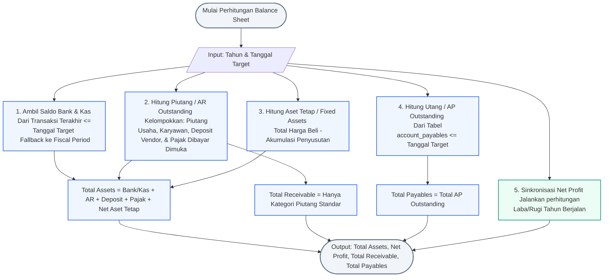

# ⚖️ Balance Sheet Card Data Flow & Native Query

Dokumen ini menjelaskan alur logika perhitungan dan pengambilan data untuk dashboard card pada tab **Balance Sheet** (Total Assets, Net Profit, Total Receivable, dan Total Payables) beserta Native SQL Query PostgreSQL yang dioptimalkan.

---

## 📊 1. Flowchart Perhitungan Balance Sheet

Algoritma di bawah ini mendemonstrasikan bagaimana sistem mengumpulkan saldo as-of date (tanggal berjalan target) dari akun bank/kas, menghitung outstanding piutang (AR) & utang (AP), menghitung nilai buku aset tetap (Fixed Assets), serta menyinkronkan Laba Bersih tahun target dari modul P&L.

> [!TIP]
> **Skenario Contoh**:
> Alur di bawah ini disimulasikan menggunakan parameter input berikut:
> * **Filter Tahun**: `2025`
> * **Batas Tanggal Laporan (As of)**: `2025-12-31 23:59:59.999`




---

## 💻 2. Native SQL Query (PostgreSQL)

Query terpadu di bawah ini menggunakan **Common Table Expressions (CTE)** untuk menghitung total saldo aset secara akumulatif (*as-of date*) dan menyatukannya dengan posisi piutang, utang, dan laba berjalan.

> [!NOTE]
> **Penjelasan Konteks & Parameter Contoh**:
> * **Filter Tahun & Tanggal**: Tahun fiskal **`2025`** dan batas tanggal **`2025-12-31 23:59:59.999`** (`target_year = 2025`, `target_date = '2025-12-31 23:59:59.999'`).
> * **Kasus Kolom Case-Sensitive**:
>   * Tabel `account_receivables` menggunakan penamaan kolom camelCase (`colB`, `colC`, `colR`) tanpa `@map` di Prisma, sehingga wajib diapit tanda kutip ganda (`"colB"`, `"colC"`, `"colR"`).
>   * Tabel `account_payables` menggunakan penamaan kolom camelCase (`colB`, `colS`) tanpa `@map` di Prisma, sehingga wajib diapit tanda kutip ganda (`"colB"`, `"colS"`).
>   * Tabel `sales_records` menggunakan penamaan kolom camelCase (`colC`, `colJ`, `colK`) tanpa `@map` di Prisma, sehingga wajib diapit tanda kutip ganda (`"colC"`, `"colJ"`, `"colK"`).

```sql
WITH params AS (
    SELECT 
        2025 AS target_year,
        '2025-12-31 23:59:59.999'::timestamp AS target_date
),
bank_cash_balances AS (
    SELECT COALESCE(SUM(latest_bal), 0) AS total_bank_cash
    FROM (
        SELECT ia.id,
            COALESCE(
                (
                    SELECT col_e FROM financial_transactions 
                    WHERE internal_account_id = ia.id 
                      AND col_a <= (SELECT target_date FROM params)
                    ORDER BY col_a DESC, id DESC 
                    LIMIT 1
                ),
                (
                    SELECT opening_balance FROM fiscal_periods 
                    WHERE internal_account_id = ia.id 
                      AND year = (SELECT target_year FROM params)
                ),
                0
            ) AS latest_bal
        FROM internal_accounts ia
        WHERE ia.type IN ('BANK', 'CASH')
    ) sub
),
ar_all AS (
    SELECT 
        id, "colB", "colR"
    FROM account_receivables, params
    WHERE (
        (CASE WHEN "colC" ~ '^\d{4}-\d{2}-\d{2}' THEN "colC"::timestamp ELSE NULL END) <= target_date
        OR
        (CASE WHEN "colC" ~ '^\b(19|20)\d{2}\b' THEN SUBSTRING("colC" FROM '\b(19|20)\d{2}\b')::integer ELSE 0 END) <= target_year
    )
),
ar_receivable AS (
    SELECT COALESCE(SUM("colR"), 0) AS total_ar
    FROM ar_all
    WHERE "colB" ILIKE '%ar cash advance%'
       OR "colB" ILIKE '%ar others%'
       OR "colB" ILIKE '%ar refund%'
       OR "colB" ILIKE '%ar staff%loan%'
       OR "colB" ILIKE '%ar temporary%'
       OR "colB" ILIKE '%ar trade%'
),
ar_deposit AS (
    SELECT COALESCE(SUM("colR"), 0) AS total_deposit
    FROM ar_all
    WHERE "colB" ILIKE '%ar deposit to vendor%'
),
ar_prepaid_tax AS (
    SELECT COALESCE(SUM("colR"), 0) AS total_prepaid_tax
    FROM ar_all
    WHERE "colB" ILIKE '%ar prepaid tax%'
),
fixed_assets AS (
    SELECT 
        COALESCE(SUM(col_d), 0) - 1183894353.6667 AS total_fixed_assets
    FROM depreciation, params
    WHERE col_a <= target_date
),
payables_ap AS (
    SELECT COALESCE(SUM("colS"), 0) AS total_ap
    FROM account_payables, params
    WHERE "colB" <= target_year
),
pl_properties AS (
    SELECT 
        MAX(CASE WHEN key = 'PL_NET_SALES' THEN CAST(value AS DECIMAL(19, 4)) END) AS override_net_sales,
        MAX(CASE WHEN key = 'PL_PERSONNEL_EXP' THEN CAST(value AS DECIMAL(19, 4)) END) AS override_personnel_exp,
        MAX(CASE WHEN key = 'PL_OFFICE_EXP' THEN CAST(value AS DECIMAL(19, 4)) END) AS override_office_exp,
        MAX(CASE WHEN key = 'PL_MARKETING_EXP' THEN CAST(value AS DECIMAL(19, 4)) END) AS override_marketing_exp,
        MAX(CASE WHEN key = 'PL_FINANCIAL_EXP' THEN CAST(value AS DECIMAL(19, 4)) END) AS override_financial_exp,
        MAX(CASE WHEN key = 'PL_OTHER_INCOME' THEN CAST(value AS DECIMAL(19, 4)) END) AS override_other_income,
        MAX(CASE WHEN key = 'PL_DEPRECIATION' THEN CAST(value AS DECIMAL(19, 4)) END) AS override_depreciation,
        MAX(CASE WHEN key = 'PL_INCOME_TAX' THEN CAST(value AS DECIMAL(19, 4)) END) AS override_income_tax,
        MAX(CASE WHEN key = 'PL_NET_PROFIT' THEN CAST(value AS DECIMAL(19, 4)) END) AS override_net_profit
    FROM equity_properties, params
    WHERE year = target_year
),
sales_data AS (
    SELECT 
        COALESCE(SUM("colK"), 0) AS gross_sales,
        COALESCE(SUM("colJ"), 0) AS vat_amount
    FROM sales_records, params
    WHERE "colC" >= make_date(target_year, 1, 1)::timestamp
      AND "colC" < make_date(target_year + 1, 1, 1)::timestamp
),
cogs_data AS (
    SELECT 
        COALESCE(SUM(COALESCE(col_d, 0) - COALESCE(col_c, 0)), 0) AS cogs_total
    FROM financial_transactions, params
    WHERE col_f ILIKE '%cost of goods%'
      AND col_a >= make_date(target_year, 1, 1)::timestamp
      AND col_a < make_date(target_year + 1, 1, 1)::timestamp
),
expenses_data AS (
    SELECT 
        COALESCE(SUM(CASE WHEN col_f ILIKE 'Personnel Expense' THEN COALESCE(col_d, 0) - COALESCE(col_c, 0) ELSE 0 END), 0) AS personnel_raw,
        COALESCE(SUM(CASE WHEN col_f ILIKE 'Office Expense' THEN COALESCE(col_d, 0) - COALESCE(col_c, 0) ELSE 0 END), 0) AS office_raw,
        COALESCE(SUM(CASE WHEN col_f ILIKE 'Marketing Expense' THEN COALESCE(col_d, 0) - COALESCE(col_c, 0) ELSE 0 END), 0) AS marketing_raw,
        COALESCE(SUM(CASE WHEN col_f ILIKE 'Financial Expense' THEN COALESCE(col_d, 0) - COALESCE(col_c, 0) ELSE 0 END), 0) AS financial_raw
    FROM financial_transactions, params
    WHERE col_a >= make_date(target_year, 1, 1)::timestamp
      AND col_a < make_date(target_year + 1, 1, 1)::timestamp
),
other_income AS (
    SELECT 
        COALESCE(SUM(COALESCE(col_d, 0) - COALESCE(col_c, 0)), 0) AS other_income_raw
    FROM financial_transactions, params
    WHERE col_f ILIKE '%other income%'
      AND col_a >= make_date(target_year, 1, 1)::timestamp
      AND col_a < make_date(target_year + 1, 1, 1)::timestamp
),
depreciation_data AS (
    SELECT 
        COALESCE(SUM(col_s), 0) AS depr_raw
    FROM depreciation
),
income_tax_data AS (
    SELECT 
        COALESCE(SUM(-COALESCE(col_c, 0)), 0) AS tax_raw
    FROM financial_transactions ft
    JOIN internal_accounts ia ON ft.internal_account_id = ia.id
    WHERE ft.col_f ILIKE 'Account Receivable'
      AND ft.col_g ILIKE 'AR Prepaid Tax'
      AND (ft.col_h ILIKE '%pph-23%' OR ft.col_h ILIKE '%pph 23%')
      AND ia.type = 'OTHER'
      AND ia.holder_name ILIKE '%non cash & bank%'
      AND ft.col_a >= make_date((SELECT target_year FROM params), 1, 1)::timestamp
      AND ft.col_a < make_date((SELECT target_year FROM params) + 1, 1, 1)::timestamp
),
net_profit_calc AS (
    SELECT 
        COALESCE(
            prop.override_net_profit,
            (
                ((COALESCE(prop.override_net_sales, sales.gross_sales - sales.vat_amount) + cogs.cogs_total) 
                + (
                    COALESCE(-prop.override_personnel_exp, exp.personnel_raw) +
                    COALESCE(-prop.override_office_exp, exp.office_raw) +
                    COALESCE(-prop.override_marketing_exp, exp.marketing_raw) +
                    COALESCE(-prop.override_financial_exp, exp.financial_raw)
                ))
            )
            + COALESCE(prop.override_other_income, oth.other_income_raw)
            - COALESCE(prop.override_depreciation, depr.depr_raw)
            - COALESCE(prop.override_income_tax, tax.tax_raw)
        ) AS net_profit
    FROM sales_data sales
    CROSS JOIN cogs_data cogs
    CROSS JOIN expenses_data exp
    CROSS JOIN other_income oth
    CROSS JOIN depreciation_data depr
    CROSS JOIN income_tax_data tax
    CROSS JOIN pl_properties prop
)
SELECT 
    (bc.total_bank_cash + ar.total_ar + dep.total_deposit + tax_pt.total_prepaid_tax + fa.total_fixed_assets) AS total_assets,
    np.net_profit,
    ar.total_ar AS total_receivable,
    ap.total_ap AS total_payables
FROM bank_cash_balances bc
CROSS JOIN ar_receivable ar
CROSS JOIN ar_deposit dep
CROSS JOIN ar_prepaid_tax tax_pt
CROSS JOIN fixed_assets fa
CROSS JOIN payables_ap ap
CROSS JOIN net_profit_calc np;
```

---

## 🔍 3. Detail Parameter & Logika Bisnis

### A. Parameter Query
* **`:year`** *(Integer)*: Tahun target analisis posisi neraca berjalan (contoh: `2025`).
* **`:end_date`** *(String / Timestamp)*: Batas tanggal atas pencarian saldo berjalan (*as-of date*, contoh: `'2025-12-31 23:59:59.999'`).

### B. Hubungan Antar Card (Accounting Identity)
* **Total Assets**: Hasil dari semua hak milik korporasi, yang harus sama persis dengan total kewajiban dan ekuitas (`Assets = Liabilities + Equity`).
* **Total Payables**: Mencakup seluruh kewajiban lancar (pada tabel `account_payables`).
* **Net Profit**: Berfungsi sebagai jembatan dari laporan Laba/Rugi berjalan untuk memperbarui porsi **Retained Earnings** (Laba Ditahan) di sisi Ekuitas secara dinamis.
