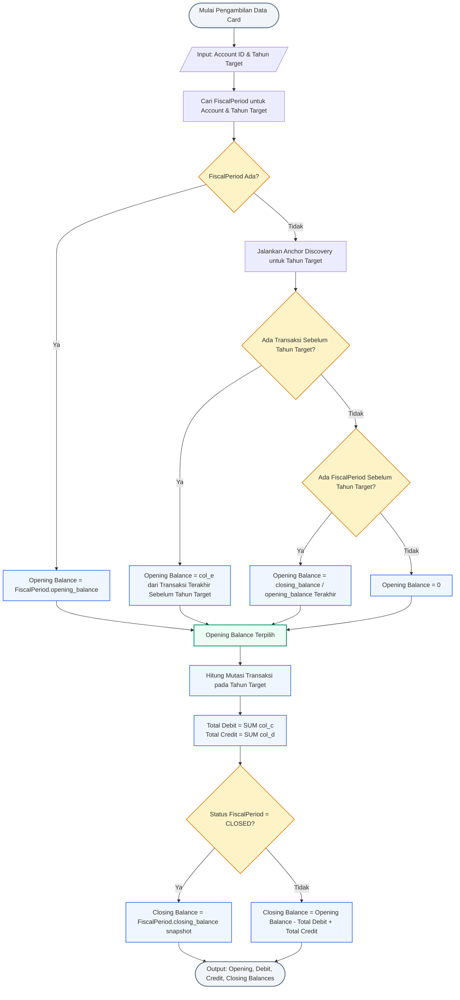

# 🏦 Bank Mutation Card Data Flow & Native Query

Dokumen ini menjelaskan alur logika pengambilan data untuk dashboard card pada modul Bank Mutation (Opening Balance, Total Debit, Total Credit, dan Closing Balance) beserta Native SQL Query PostgreSQL yang dioptimalkan untuk performa tinggi.

---

## 📊 1. Flowchart Resolusi Data Card

Algoritma di bawah ini mendemonstrasikan bagaimana sistem menentukan nilai saldo awal secara dinamis (menggunakan *anchor discovery* jika data tahun berjalan belum disetup) serta menghitung saldo akhir proyeksi maupun saldo akhir yang sudah di-audit (*CLOSED*).

> [!TIP]
> **Skenario Contoh**:
> Alur di bawah ini disimulasikan menggunakan parameter input berikut:
> * **Account ID**: `1` (Bank **BCA** - No. Rekening: `5750 489 666`, Cabang Sahardjo, a.n. RD Hidianitje)
> * **Filter Tahun**: `2025`
> * **Filter Tanggal Transaksi**: Tanggal Mulai (`2025-01-01`) s.d. Tanggal Selesai (`2025-12-31`)




---

## 💻 2. Native SQL Query (PostgreSQL)

Query terpadu ini menggunakan **Common Table Expressions (CTE)** untuk menggabungkan penelusuran histori saldo dan akumulasi transaksi tahun berjalan dalam satu kali jalan. Hal ini meminimalkan latensi jaringan dan memaksimalkan efisiensi eksekusi di sisi database.

> [!NOTE]
> **Penjelasan Konteks & Parameter Contoh**:
> * **Nama Bank & Nomor Rekening**: Query di bawah ditargetkan untuk **Account ID: `1`** (Bank **BCA**, No. Rekening: `5750 489 666`, Cabang Sahardjo, a.n. RD Hidianitje).
> * **Filter Tahun**: Tahun fiskal **`2025`** (`year = 2025`).
> * **Filter Tanggal**: Transaksi yang dilibatkan hanya yang berada dalam rentang tanggal **`2025-01-01`** s.d. **`2025-12-31`** (ditangani oleh fungsi `make_date(2025, 1, 1)` dan `make_date(2026, 1, 1)`).


```sql
WITH params AS (
    SELECT 
        1 AS target_account_id,
        2025 AS target_year
),
target_fiscal AS (
    SELECT 
        opening_balance,
        closing_balance,
        status::text AS status
    FROM fiscal_periods, params
    WHERE internal_account_id = target_account_id
      AND year = target_year
),
discovered_anchor AS (
    SELECT COALESCE(
        (
            SELECT col_e 
            FROM financial_transactions, params 
            WHERE internal_account_id = target_account_id 
              AND col_a < make_date(target_year, 1, 1)::timestamp
            ORDER BY col_a DESC, id DESC 
            LIMIT 1
        ),
        (
            SELECT COALESCE(closing_balance, opening_balance) 
            FROM fiscal_periods, params 
            WHERE internal_account_id = target_account_id 
              AND year < target_year
            ORDER BY year DESC 
            LIMIT 1
        ),
        0
    ) AS balance
),
transactions_summary AS (
    SELECT 
        COALESCE(SUM(col_c), 0) AS total_debit,
        COALESCE(SUM(col_d), 0) AS total_credit
    FROM financial_transactions, params
    WHERE internal_account_id = target_account_id
      AND col_a >= make_date(target_year, 1, 1)::timestamp
      AND col_a < make_date(target_year + 1, 1, 1)::timestamp
)
SELECT 
    COALESCE(f.opening_balance, a.balance) AS opening_balance,
    t.total_debit,
    t.total_credit,
    CASE 
        WHEN f.status = 'CLOSED' AND f.closing_balance IS NOT NULL THEN f.closing_balance
        ELSE (COALESCE(f.opening_balance, a.balance) - t.total_debit + t.total_credit)
    END AS closing_balance,
    COALESCE(f.status, 'INITIAL') AS period_status
FROM transactions_summary t
CROSS JOIN discovered_anchor a
LEFT JOIN target_fiscal f ON TRUE;
```

---

## 🔍 3. Detail Parameter, Hubungan Bank, & Filter Query

### A. Asal Data Bank / Kas (Source Bank Identification)
Query di atas mengambil data transaksi berdasarkan parameter `:account_id` yang merujuk pada tabel `internal_accounts`. Untuk mengetahui identitas bank atau kas secara lengkap, tabel tersebut berelasi dengan tabel `banks`:
* **Tabel Acuan**: `internal_accounts` (menyimpan data nomor rekening `account_no`, tipe akun `type` [BANK/CASH/OTHER], dan nama pemilik `holder_name`).
* **Relasi Bank**: Dihubungkan ke tabel `banks` via kolom `bank_id` untuk mendapatkan merk bank (`bank_brand` seperti *BCA*, *Mandiri*, *BRI*, *BTN*) dan nama resmi bank (`bank_name`).
* **Contoh Query Identifikasi Bank**:
  ```sql
  SELECT ia.id, ia.account_no, ia.type, ia.holder_name, b.bank_brand, b.bank_name
  FROM internal_accounts ia
  LEFT JOIN banks b ON ia.bank_id = b.id
  WHERE ia.id = :account_id;
  ```

### B. Daftar Filter yang Diterapkan (Query Filters)
Query native di atas menerapkan filter berlapis untuk memastikan presisi data dan efisiensi index scanning:
1. **Filter Akun (`internal_account_id = :account_id`)**:
   Membatasi pencarian hanya pada satu rekening bank/kas spesifik. Ini dipasang pada semua CTE (`target_fiscal`, `discovered_anchor`, dan `transactions_summary`) sehingga query planner dapat langsung melakukan *Index Scan* secara spesifik.
2. **Filter Tahun Fiskal (`year = :year` / `year < :year`)**:
   * Digunakan untuk mencocokkan saldo awal audit (`opening_balance`) tahun target.
   * Digunakan untuk mencari saldo tahun-tahun sebelumnya (`year < :year`) sebagai acuan *anchor* historis.
3. **Filter Rentang Waktu Transaksi (`col_a`)**:
   * **Untuk Mutasi Tahun Berjalan**: `col_a >= make_date(:year, 1, 1)::timestamp AND col_a < make_date(:year + 1, 1, 1)::timestamp`. Filter ini memastikan hanya transaksi yang tercatat dari tanggal 1 Januari pukul `00:00:00` sampai 31 Desember pukul `23:59:59` pada tahun target yang dihitung.
   * **Untuk Saldo Anchor Sebelum Tahun Target**: `col_a < make_date(:year, 1, 1)::timestamp`. Digunakan untuk mencari saldo berjalan terakhir sebelum tahun target dimulai.

### C. Rumus Perhitungan Mutasi
Sesuai dengan ketentuan data akuntansi korporat pada sistem ini:
* **Debit (`col_c`)**: Merupakan penarikan dana/pengeluaran (*Withdrawal*), sehingga **mengurangi** nilai saldo.
* **Credit (`col_d`)**: Merupakan setoran dana/pemasukan (*Deposit*), sehingga **menambah** nilai saldo.
* **Proyeksi Akhir**: `Opening Balance - Total Debit + Total Credit`.

---

## 🏛️ 4. Analisis Performa & Tata Kelola

* **Optimalisasi Jaringan**: Pendekatan client-side sebelumnya memanggil 3 endpoint terpisah (`getFiscalPeriods`, `getAnchorBalance`, dan `getAllTransactions`). Dengan Native Query ini, visual card dapat diisi menggunakan **satu round-trip query** tunggal.
* **Dukungan Indeks**: Query memanfaatkan indeks unik pada `fiscal_periods` `(internal_account_id, year)` serta indeks komposit waktu pada `financial_transactions` `(internal_account_id, col_a, id)` untuk pencarian *O(log N)* yang instan.

---

## ⚖️ 5. Sumber Data Setiap Card (Deskripsi Bisnis)

Berikut adalah ringkasan asal-usul data dan rumus perhitungan untuk setiap card pada modul **Bank Mutation**:

### A. Opening Balance (Saldo Awal)
Saldo awal rekening dihitung secara berjenjang berdasarkan prioritas berikut:

| Komponen / Prioritas | Tabel Sumber | Keterangan Nilai | Filter / Kondisi |
|---|---|---|---|
| **Saldo Awal Audit (Prioritas 1)** | Periode Fiskal (*Fiscal Periods*) | Nilai Saldo Awal yang disetup untuk rekening tersebut pada tahun berjalan | Akun dan Tahun terpilih |
| **Transaksi Terakhir (Prioritas 2 / Anchor)** | Transaksi Finansial (*Financial Transactions*) | **Saldo Berjalan (Running Balance)** dari transaksi terakhir | Tanggal transaksi < Awal tahun berjalan (misal sebelum 1 Januari) |
| **Periode Fiskal Sebelumnya (Prioritas 3)** | Periode Fiskal (*Fiscal Periods*) | **Saldo Akhir** atau **Saldo Awal** dari tahun sebelum tahun berjalan | Tahun transaksi < Tahun target (diambil tahun terdekat) |
| **Default (Prioritas 4)** | — | **0** | Jika tidak ditemukan data historis apa pun |

---

### B. Total Debit (Mutasi Keluar)
Total pengeluaran dari rekening terpilih selama periode filter.

| Komponen | Tabel Sumber | Keterangan Nilai | Filter / Kondisi |
|---|---|---|---|
| **Total Debit** | Transaksi Finansial (*Financial Transactions*) | **Jumlah Total Pengeluaran (Debit)** | Rekening terpilih, Tanggal transaksi berada dalam tahun berjalan |

---

### C. Total Credit (Mutasi Masuk)
Total penerimaan ke rekening terpilih selama periode filter.

| Komponen | Tabel Sumber | Keterangan Nilai | Filter / Kondisi |
|---|---|---|---|
| **Total Credit** | Transaksi Finansial (*Financial Transactions*) | **Jumlah Total Penerimaan (Credit)** | Rekening terpilih, Tanggal transaksi berada dalam tahun berjalan |

---

### D. Closing Balance (Saldo Akhir)
Saldo akhir rekening pada akhir periode filter, ditentukan berdasarkan status audit tahun fiskal:

| Skenario | Tabel Sumber / Metode | Keterangan Perhitungan | Filter / Kondisi |
|---|---|---|---|
| **Tahun Fiskal CLOSED (Terkunci/Audit)** | Periode Fiskal (*Fiscal Periods*) | **Saldo Akhir (Closing Balance)** langsung dari snapshot data audit | Akun dan Tahun terpilih, status periode adalah `CLOSED` |
| **Tahun Fiskal OPEN / INITIAL (Berjalan)** | Perhitungan Dinamis | `Saldo Awal - Total Mutasi Keluar (Debit) + Total Mutasi Masuk (Credit)` | Jika status periode belum ditutup / di-audit |

