# 📈 Profit & Loss Card Data Flow & Native Query

Dokumen ini menjelaskan alur logika perhitungan dan pengambilan data untuk dashboard card pada tab **Profit & Loss** (Net Sales, Gross Profit, Operating Profit, dan Profit After Tax) beserta Native SQL Query PostgreSQL yang dioptimalkan.

---

## 📊 1. Flowchart Perhitungan Profit & Loss

Algoritma di bawah ini mendemonstrasikan bagaimana sistem mengambil data dari beberapa tabel sumber (`sales_records`, `financial_transactions`, `depreciation`), memeriksa override pada tabel `equity_properties`, dan menghitung metrik profitabilitas secara berjenjang.

> [!TIP]
> **Skenario Contoh**:
> Alur di bawah ini disimulasikan menggunakan parameter input berikut:
> * **Filter Tahun**: `2025`
> * **Rentang Waktu Laporan**: `2025-01-01` s.d. `2025-12-31` (seluruh transaksi di tahun fiskal 2025)

```mermaid
graph TD
    %% Styling
    classDef startEnd fill:#f1f5f9,stroke:#64748b,stroke-width:2px;
    classDef process fill:#eff6ff,stroke:#2563eb,stroke-width:1.5px;
    classDef decision fill:#fef3c7,stroke:#d97706,stroke-width:1.5px;
    classDef override fill:#fdf8ec,stroke:#cc9929,stroke-width:1.5px;

    Start([Mulai Perhitungan P&L]) --> InputParams[/Input: Tahun Target/]
    InputParams --> FetchOverrides[Cari Override Nilai di equity_properties]
    
    %% --- NET SALES ---
    FetchOverrides --> CheckNetSalesOverride{Override PL_NET_SALES Ada?}
    CheckNetSalesOverride -- Ya --> UseNetSalesOverride[Net Sales = Nilai Override]
    CheckNetSalesOverride -- Tidak --> CalcNetSales[Ambil data sales_records <br> Net Sales = Gross AR - PPN/VAT]
    UseNetSalesOverride --> MergeNetSales[Net Sales Terpilih]
    CalcNetSales --> MergeNetSales
    
    %% --- GROSS PROFIT ---
    MergeNetSales --> FetchCOGS[Hitung COGS dari financial_transactions <br> Saring col_f ILIKE %cost of goods%]
    FetchCOGS --> CalcGrossProfit[Gross Profit = Net Sales + COGS <br> *COGS bernilai negatif*]
    
    %% --- OPERATING PROFIT ---
    CalcGrossProfit --> FetchOpex[Hitung OPEX dari financial_transactions <br> Saring col_f in Personnel, Office, Marketing, Financial <br> Terapkan override per kategori jika ada]
    FetchOpex --> CalcOperatingProfit[Operating Profit = Gross Profit + Total OPEX <br> *OPEX bernilai negatif*]
    
    %% --- PROFIT AFTER TAX ---
    CalcOperatingProfit --> FetchOtherIncome[Hitung Other Income & Depreciation <br> Terapkan override jika ada]
    FetchOtherIncome --> FetchTax[Hitung PPh-23 Prepaid Tax dari financial_transactions <br> Terapkan override jika ada]
    FetchTax --> CheckNetProfitOverride{Override PL_NET_PROFIT Ada?}
    CheckNetProfitOverride -- Ya --> UseNetProfitOverride[Profit After Tax = Nilai Override]
    CheckNetProfitOverride -- Tidak --> CalcProfitAfterTax[Profit After Tax = Operating Profit + Net Other Income - Income Tax]
    
    UseNetProfitOverride --> Finish([Output: Net Sales, Gross Profit, Operating Profit, Profit After Tax])
    CalcProfitAfterTax --> Finish
    
    class Start,Finish startEnd;
    class CalcNetSales,FetchCOGS,CalcGrossProfit,FetchOpex,CalcOperatingProfit,FetchOtherIncome,FetchTax,CalcProfitAfterTax process;
    class CheckNetSalesOverride,CheckNetProfitOverride decision;
    class UseNetSalesOverride,UseNetProfitOverride override;
    class MergeNetSales highlight;
```




---

## 💻 2. Native SQL Query (PostgreSQL)

Query terpadu di bawah ini menggunakan **Common Table Expressions (CTE)** untuk melakukan agregasi data dari 4 tabel berbeda (`sales_records`, `financial_transactions`, `depreciation`, dan `equity_properties`) secara paralel dalam satu jalan (*single trip*).

> [!NOTE]
> **Penjelasan Konteks & Parameter Contoh**:
> * **Filter Tahun**: Tahun fiskal **`2025`** (`year = 2025`).
> * **Filter Tanggal**: Transaksi yang dilibatkan dibatasi dari tanggal **`2025-01-01`** s.d. **`2025-12-31`** (ditangani oleh fungsi `make_date(2025, 1, 1)` dan `make_date(2026, 1, 1)`).
> * **Kasus Kolom Case-Sensitive**: Tabel `sales_records` menggunakan penamaan kolom camelCase (`colC`, `colJ`, `colK`) tanpa `@map` di Prisma, sehingga wajib diapit tanda kutip ganda (`"colC"`, `"colJ"`, `"colK"`) di PostgreSQL.

```sql
WITH params AS (
    SELECT 
        2025 AS target_year
),
properties AS (
    SELECT 
        MAX(CASE WHEN key = 'PL_NET_SALES' THEN CAST(value AS DECIMAL(19, 4)) END) AS override_net_sales,
        MAX(CASE WHEN key = 'PL_PERSONNEL_EXP' THEN CAST(value AS DECIMAL(19, 4)) END) AS override_personnel_exp,
        MAX(CASE WHEN key = 'PL_OFFICE_EXP' THEN CAST(value AS DECIMAL(19, 4)) END) AS override_office_exp,
        MAX(CASE WHEN key = 'PL_MARKETING_EXP' THEN CAST(value AS DECIMAL(19, 4)) END) AS override_marketing_exp,
        MAX(CASE WHEN key = 'PL_FINANCIAL_EXP' THEN CAST(value AS DECIMAL(19, 4)) END) AS override_financial_exp,
        MAX(CASE WHEN key = 'PL_OTHER_INCOME' THEN CAST(value AS DECIMAL(19, 4)) END) AS override_other_income,
        MAX(CASE WHEN key = 'PL_DEPRECIATION' THEN CAST(value AS DECIMAL(19, 4)) END) AS override_depreciation,
        MAX(CASE WHEN key = 'PL_INCOME_TAX' THEN CAST(value AS DECIMAL(19, 4)) END) AS override_income_tax,
        MAX(CASE WHEN key = 'PL_NET_PROFIT' THEN CAST(value AS DECIMAL(19, 4)) END) AS override_net_profit
    FROM equity_properties, params
    WHERE year = target_year
),
sales_data AS (
    SELECT 
        COALESCE(SUM("colK"), 0) AS gross_sales,
        COALESCE(SUM("colJ"), 0) AS vat_amount
    FROM sales_records, params
    WHERE "colC" >= make_date(target_year, 1, 1)::timestamp
      AND "colC" < make_date(target_year + 1, 1, 1)::timestamp
),
cogs_data AS (
    SELECT 
        COALESCE(SUM(COALESCE(col_d, 0) - COALESCE(col_c, 0)), 0) AS cogs_total
    FROM financial_transactions, params
    WHERE col_f ILIKE '%cost of goods%'
      AND col_a >= make_date(target_year, 1, 1)::timestamp
      AND col_a < make_date(target_year + 1, 1, 1)::timestamp
),
expenses_data AS (
    SELECT 
        COALESCE(SUM(CASE WHEN col_f ILIKE 'Personnel Expense' THEN COALESCE(col_d, 0) - COALESCE(col_c, 0) ELSE 0 END), 0) AS personnel_raw,
        COALESCE(SUM(CASE WHEN col_f ILIKE 'Office Expense' THEN COALESCE(col_d, 0) - COALESCE(col_c, 0) ELSE 0 END), 0) AS office_raw,
        COALESCE(SUM(CASE WHEN col_f ILIKE 'Marketing Expense' THEN COALESCE(col_d, 0) - COALESCE(col_c, 0) ELSE 0 END), 0) AS marketing_raw,
        COALESCE(SUM(CASE WHEN col_f ILIKE 'Financial Expense' THEN COALESCE(col_d, 0) - COALESCE(col_c, 0) ELSE 0 END), 0) AS financial_raw
    FROM financial_transactions, params
    WHERE col_a >= make_date(target_year, 1, 1)::timestamp
      AND col_a < make_date(target_year + 1, 1, 1)::timestamp
),
other_income AS (
    SELECT 
        COALESCE(SUM(COALESCE(col_d, 0) - COALESCE(col_c, 0)), 0) AS other_income_raw
    FROM financial_transactions, params
    WHERE col_f ILIKE '%other income%'
      AND col_a >= make_date(target_year, 1, 1)::timestamp
      AND col_a < make_date(target_year + 1, 1, 1)::timestamp
),
depreciation_data AS (
    SELECT 
        COALESCE(SUM(col_s), 0) AS depr_raw
    FROM depreciation
),
income_tax_data AS (
    SELECT 
        COALESCE(SUM(-COALESCE(col_c, 0)), 0) AS tax_raw
    FROM financial_transactions ft
    JOIN internal_accounts ia ON ft.internal_account_id = ia.id
    WHERE ft.col_f ILIKE 'Account Receivable'
      AND ft.col_g ILIKE 'AR Prepaid Tax'
      AND (ft.col_h ILIKE '%pph-23%' OR ft.col_h ILIKE '%pph 23%')
      AND ia.type = 'OTHER'
      AND ia.holder_name ILIKE '%non cash & bank%'
      AND ft.col_a >= make_date((SELECT target_year FROM params), 1, 1)::timestamp
      AND ft.col_a < make_date((SELECT target_year FROM params) + 1, 1, 1)::timestamp
)
SELECT 
    COALESCE(prop.override_net_sales, sales.gross_sales - sales.vat_amount) AS net_sales,
    COALESCE(prop.override_net_sales, sales.gross_sales - sales.vat_amount) + cogs.cogs_total AS gross_profit,
    (COALESCE(prop.override_net_sales, sales.gross_sales - sales.vat_amount) + cogs.cogs_total)
    + (
        COALESCE(-prop.override_personnel_exp, exp.personnel_raw) +
        COALESCE(-prop.override_office_exp, exp.office_raw) +
        COALESCE(-prop.override_marketing_exp, exp.marketing_raw) +
        COALESCE(-prop.override_financial_exp, exp.financial_raw)
    ) AS operating_profit,
    COALESCE(
        prop.override_net_profit,
        (
            ((COALESCE(prop.override_net_sales, sales.gross_sales - sales.vat_amount) + cogs.cogs_total)
            + (
                COALESCE(-prop.override_personnel_exp, exp.personnel_raw) +
                COALESCE(-prop.override_office_exp, exp.office_raw) +
                COALESCE(-prop.override_marketing_exp, exp.marketing_raw) +
                COALESCE(-prop.override_financial_exp, exp.financial_raw)
            ))
            + COALESCE(prop.override_other_income, oth.other_income_raw)
            - COALESCE(prop.override_depreciation, depr.depr_raw)
            - COALESCE(prop.override_income_tax, tax.tax_raw)
        )
    ) AS profit_after_tax
FROM sales_data sales
CROSS JOIN cogs_data cogs
CROSS JOIN expenses_data exp
CROSS JOIN other_income oth
CROSS JOIN depreciation_data depr
CROSS JOIN income_tax_data tax
CROSS JOIN properties prop;
```

---

## 🔍 3. Detail Parameter & Logika Bisnis

### A. Parameter Query
* **`:year`** *(Integer)*: Tahun target analisis laba-rugi (contoh: `2025`).

### B. Aturan Penanda Nilai (Signs Standard)
* Pendapatan (**Net Sales** & **Other Income**) bernilai **positif**.
* Beban (**COGS**, **Expenses**, **Depreciation**, **Income Tax**) dihitung sebagai nilai **negatif** di dalam query (`Credit - Debit` menghasilkan nilai negatif karena porsi Debit lebih besar untuk transaksi beban).
* Formula penjumlahan pada baris akhir otomatis menyesuaikan nilai negatif tersebut (misal: `Gross Profit = Net Sales + cogs_total` yang secara matematis melakukan pengurangan `Net Sales - |cogs_total|`).
